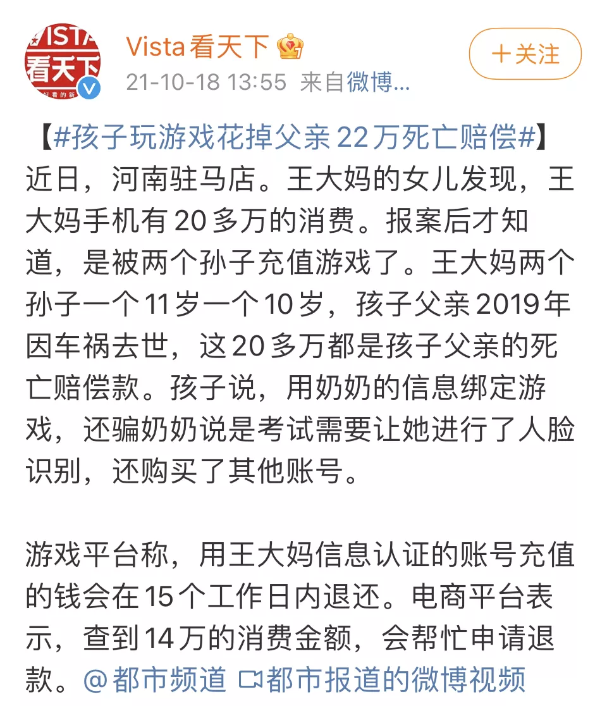

# “双减”第一次期末考试后，才知道谁在裸泳：快乐教育输了，佛系爸妈败了

2022-01-20

最近一段时间，各大学校的期末考试陆续结束了。
作为“双减”实施后的第一次大考，无论是老师还是家长，都对这次考试无比关注。
然而，拿到成绩后，却是几家欢喜几家愁。
前几天，我还在后台看到了这样一则留言：
> **“我最近真的好焦虑。**
> **记得‘双减’政策刚出来的时候，我还挺高兴的：**
> **孩子作业少了、负担轻了，周末也不用耗在补习班了。**
> **可谁知，期末成绩一出，以前稳居班级前十的他，这次好几门连80分都没有。”**

随后，这位妈妈又补充道：

> **“平时，我问他最近学习怎么样，他总说‘学会了’；**
> **考完试，我问他考得怎么样，他也说‘挺好的’。**
> **可为什么成绩会退步这么多呢？”**

事实上，这种情况绝非个例。
“双减”前，很多孩子凭借着父母的催促，老师的监督，机构的“加餐”，往往都能取得还不错的成绩 。
但同时，也隐藏了不少自身的问题。
**直到“双减”落地后，这些问题才彻底暴露出来。**
正如巴菲特的那句名言：“大潮退去，才知道谁在裸泳。”

## “双减”减轻了孩子的负担也拉开了孩子间的差距

“双减”后的第一个学期，孩子们的生活发生了翻天覆地的改变：
作业数量大幅缩减了，一二年级不布置家庭书面作业；
考试次数减少了，一二年级取消纸笔考试……
然而，尽管没了作业的加持和考试的压力，有的孩子依旧严格要求自己，每天专心听讲，认认真真做笔记。
可也有不少孩子，开始逐渐放纵自己：
课堂上不认真听讲，回家后不写作业、不复习，整天想方设法玩游戏……
记得曾看过这样一则新闻：
三个月前，河南驻马店，有两个孩子，一个10岁，一个11岁。
他们先用奶奶的信息注册了游戏账户，随后，又骗奶奶是考试需要，通过了人脸识别。
就这样，短短几个月花光了父亲22万的死亡赔偿金。

看完新闻，只剩下一声叹息：
**当那些自律的孩子正在拼命划桨时，另一些孩子却开始松懈、日渐堕落。他们丝毫没有意识到，自己正在被同龄人远远抛在身后。**

网上曾流传过一个数学公式：

这一公式，放在孩子身上同样是成立的。
1.01就代表了每天多努力一点点，坚持一整年，孩子将会取得飞跃式的进步。
而0.99则代表了每天懈怠一点点，经过了日复一日的更迭，孩子终将被打回到原点。
**每天是学习还是玩游戏，短时间内看不出差距。**
**但经过一个学期的沉淀，到了期末考试的那一刻，同一个班级的孩子之间，已经出现一道难以逾越的鸿沟。**

## 对孩子的成绩影响最大的不是学校，不是机构，而是家庭

同样的老师，相同的教材，为什么有的孩子名列前茅，有的孩子却只能徘徊在及格线的边缘呢？
说到底，造成孩子之间差异的真正原因，还是在于家长。
最近，有一对学霸双胞胎火了。
2018年，哥哥李世乾以667分的成绩考入电子科技大学，弟弟李世坤以654分考上了四川大学。
如今，兄弟俩双双被保送至北京大学。
哥哥擅长科研，本科在校期间，曾连续三年综合排名第一，获得了10余项国家级、校级奖项，发表了2篇SCI论文；
而弟弟的实践能力更加突出，大学四年，获得了20多项国家级、省级竞赛奖项。
**学霸并非是天生的。这种“复制粘贴”般的优秀背后，其实是家庭的悉心浇灌。**
从小到大，“乾坤”兄弟的家里都没有过多的苛责，没有成篇的大道理，有的只是高质量的陪伴——
孩子学习时，父母就在一旁看书，给孩子营造一个良好的学习环境；
孩子因成绩不理想而失落时，父母第一时间帮孩子找原因、做分析。
**始于陪伴，陷于教育，忠于爱和接纳。**
**这便是父母能够给予孩子最好的“成长养料”。**
教育部基础教育质量监测中心的副主任胡平平说：

> **“国际上和我们都做过学生分数的检测，影响它的因素第一个是学生家庭和本人，我们把它们统称为个体差异，占60%到65%的份额，这是左右分数最大的因素。**
> **第二个是区域生态和氛围，以及区域给教育提供的支持，占20%到25%左右；**
> **第三个才是学校，影响只占10%到15%。”**

特别是现在：
**校内不断减负，机构逐渐退出，但家庭教育的占比却越来越大。**
父母不仅是孩子的监护人，更是孩子永远的“第一责任人”。
那些学校没办法顾及的，老师没办法覆盖的，都需要父母用汗水去填补其中的空白。
**唯有父母跟上时代的步伐，洞悉“双减”的本质，提前为孩子做好规划，孩子才不会在虚度光阴中，坐上通往平庸人生的滑梯。**

## 在教育的道路上，永远不要指望孩子自觉

曾经，我也是一位“佛系妈妈”。
总觉得学习应该是孩子自己的事情，孩子死活就是不学，家长又能怎么办呢？
直到身边一位当老师的朋友，一针见血地指出：

> **“孩童时期，本来就是最没有自控力的时期。**
> **这一阶段，他们真正擅长的是知难而退，是半途而废，是避重就轻。**
> **让他们认认真真做半小时题或许做不到，但通过撒娇、耍小聪明逃避学习，他们个个都是无师自通的高手。”**

这一刻，我才恍然大悟：
孩子之所以是孩子，就是因为他是感性的，是情绪化的。
他看不到未来十年、二十年那么远，只知道眼前的快乐最重要。为了一时半刻的欢愉，他会察言观色，一步一步试探家长的底线。
**如果父母光指望孩子自觉，看似是给了孩子更多的空间和信任。**
**实际上，却让他一点点丧失了未来的竞争力。**
更悲哀的是，等他长大了、懂事了，还会埋怨父母当初没能尽到责任。
还记得《家有儿女》中那段经典的对白吗？
刘星问妈妈：
> **“妈，你当初为什么不逼我？”**

妈妈说：
> **“小时候给你报这班报那班，想让你学，是你自己不好好学啊！”**

刘星反问道：
> **“我不愿意学，您就不让我学了？那时候我还小，我不懂事，您还不懂事吗？”**
> **您就应该从小培养我、教育我、从小您就逼着我学呀！”**

**孩子可以任性，但是父母永远不能。**
**没有天生就自觉、自律的孩子，有的只是狠下心严格教导孩子，并能够长期耐心监督孩子的父母。**

## 真正的优秀，都是父母管出来的

西奥多·罗斯福有一句经典的名言：
> **“有一种品质，可以使一个人在碌碌无为的平庸之辈中脱颖而出。**
> **这个品质不是天资，不是教育，也不是智商，而是自律。”**

想要培养一个自律的孩子，绝不是动动嘴就够了。
作为父母，一定要用心引导，做好以下三点：
### 1. 父母以身作则比口头教育更有效

之前看过一个视频，有个小男孩翻看了妈妈的学习笔记后，突然开始抽泣，把头埋在妈妈怀里哽咽地说：
> **“对不起，妈妈，我没有好好学习。”**

网友纷纷留言表示：
**父母的正面榜样，胜过一切说教的言语。**
孩子或许不听我们的话，但他一定会模仿着我们的一言一行。
每天回家后，父母少玩手机，最好不玩。
不要让孩子觉得，凭什么你可以不自律我却不行。
### **2. 趁早立规矩，并严格执行它**

高考状元杨晨煜的妈妈在谈到教育孩子的经验时，这样说道：
> **“一定要在孩子没有自主思考能力的时候，督促他养成好习惯。**
> **这个过程很痛苦，你得时时刻刻监督着他，留意着他。**
> **等他定型之后，后面的路自然就好走了。”**

心理学家将孩子的3到6岁定为“潮湿水泥期”。
在这一时期，孩子85%的性格、习惯和生活方式，都能被很好的塑造。
而到了7到12岁，就进入了“正凝固的水泥期”，这时候孩子85%到90%的性格、习惯都已经形成。
以后再想改过来，就变得很困难了。
因此，父母要尽早给孩子立下学习的规矩，并严格执行。
让规矩来约束孩子的行为，而不是父母24小时的监视。
### **3. 给孩子设立“停工期”**

心理学研究发现：
比起一直忙于处理各项任务的人来说，那些懂得适时给大脑“放个假”的人往往更能抵御住诱惑，专注自己的任务。
随着学习压力的增加，每个孩子都需要一个“停工期”。
停工，并不意味着要玩游戏、看电视。
可能是冥想、小睡，或是单纯做做白日梦，让大脑放空。
总之，只有当孩子身处松弛有度的环境中，他才能获得更多的心理能量，持续地进步。
再聪明的孩子，父母不监督、不培养，最终也难成大器。
**小时候，父母用外力约束孩子。**
**等孩子长大了，自然就能养成自律的好习惯。**
这虽然不能决定一个孩子未来的上限有多高，但至少可以保证孩子的下限不会差。

## 总结

最后，我想向大家分享心理学家贺岭峰在演讲中说的一段话：
有一回，他女儿数学考了59分。
不敢把成绩单拿给妈妈看，就用手捂着成绩，要他帮忙签字。
看到试卷上鲜红的59分时，他虽然心里一沉，但还是努力控制住自己的情绪，跟女儿分析道：

> **“考试分为两种：一种是选拔性测试，另一种是诊断测试。**
> **你看，你们班那么多人考100分，意味着他们没必要参加这次考试，因为他们没诊断出任何问题。**
> **而你诊断出了41分的问题，把这些问题找出、改正，你就是这次考试最大的受益者。”**

一番话深入浅出，听得人豁然开朗。
事实上，作为家长，时刻要记住一点：
**平时的考试都是用来发现问题的。**
孩子成绩差，问题不只在自身。
只有做家长的及时帮助孩子分析失误、解决问题，孩子才能成长起来。
因此，无论孩子的成绩怎样，都请坚定地告诉他：

> **“孩子，乾坤未定之前，人人皆是黑马，一切都还有峰回路转的可能。**
> **未来的日子里，妈妈都会和你一起努力。**
> **而你要做的，就是把过程交给自己，把结果交给时间。”**

所以，这个寒假，请家长们一定要站在孩子身边，专注地和孩子一起改正，一起努力。
相信待到开学那时，自会有一番好风景！

2022-01-20